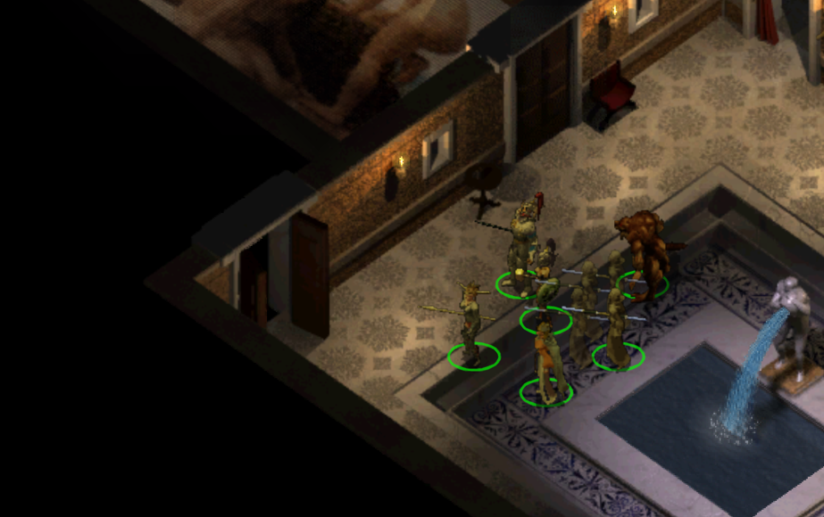
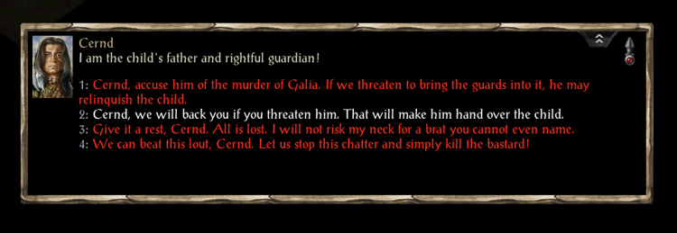
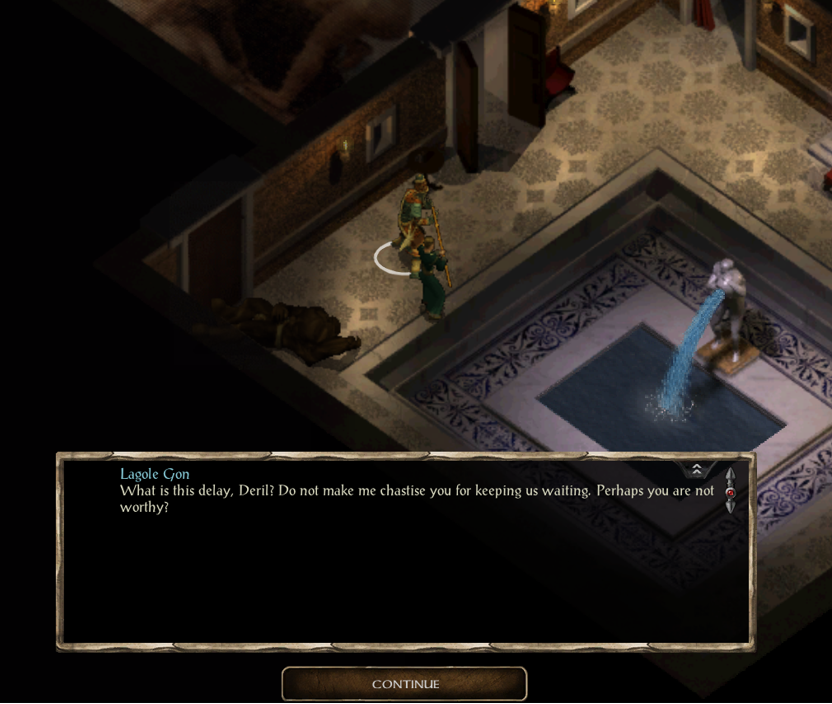

# Deril's Mansion extended - behind the locked door

---

* Ever wondered who Deril's guests are and what exactly lies behind the locked door in his mansion?
* Ever felt disappointed that his threats of "dealing with you later" never come to fruition?

This mod expands Cernd's quest finale in case you go down the "peaceful" path during your encounter 
with Deril, effectively leading up to Lagole Gon showing up and the two of them escaping after
handing over Cernd's child.

Following the resolution, Cernd voices his concerns over letting Deril go and you
are then presented with two choices of how you want to address his potential return.

---

### Option 1 - Preemptive Strike
You agree with Cernd that exposing yourselves to an ambush might not be the best idea.
You two decide to meet up in Druid's Grove in 1 day, then 
head back to Deril's mansion to finish him off before giving him the chance
to come back for you.

But it seems the meeting he was holding that day has not yet concluded...

### Option 2 - Come at me bro
You tell Cernd that you're not interested in returning to the mansion.
You'll worry about Deril if he actually decides to carry out his threats.

This time though, Deril is a man of his word. He hasn't forgotten about you
and as soon as he makes some time, you might wake up to a surprise.

---

## Additional information

**[Difficulty]**

While designing the fights, I was balancing them against the party of 6 characters in 10-12 level range,
taken from a saved game of a friend of mine who was doing his first BG2 playthrough. This is the party that he
had at the moment of starting Cernd's questline.

The fights are meant to be challenging for parties in that level range - you are unlikely to win on 
your first try. It is necessary to experience the capabilities of each and every opponent,
so that you can prepare properly and think of a tactic. It took me several attempts before 
beating my own creations :)

**[Hints]**

* Even if you initially decline the idea of preemptive attack, you are allowed 
  to change your mind. Simply visit the mansion after at least 1 day has passed.
 
* Option 2 will not leave you much control over the situation, it is also 
   harder to deal with. Option 1, however, can be resolved
   in more than one way. Your charisma and reputation will play the deciding role.

* Option 2 is triggered by resting if 4 days have passed 
  since your first encounter with Deril

* Bringing the Carsomyr into the guest room may pick someone's interest

* I recommend making a save and trying both options (in case the 'hostile' 
   resolution in Option 1 wasn't challenging enough)
   

**[Mild spoilers (read after playing)]**

The idea for this mod as well as the first steps of its creation came about
in 2016. It was originally meant to have Option 3 - convince Lagole Gon and 
the others that you can replace Deril. Then, through a series of quests, you
would help the Pillar gain power it Atkathla, all while finding out more about 
the 5 members: their backstories & individual motivations.

Admittedly, I aimed too high and it led this project to a long hiatus, but
I've been refusing to add this to the pile of my incomplete works, so after 6 years
I made the decision to cut the scope and complete it 
as a simple Cernd's quest epilogue :) 

---
**All feedback, positive or negative, is deeply appreciated!**

Malcolm Millenium

---
